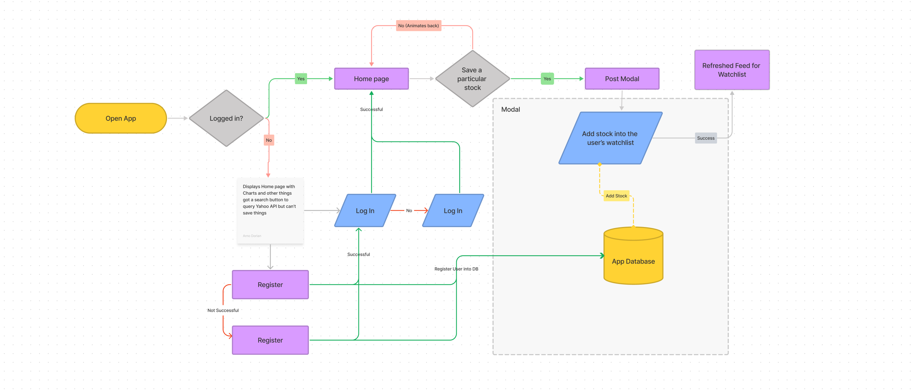

# IBull

## Project Overview
IBull is a stock viewer that charts out your stock that you want to see with necessary information of the stock such as PE ratios, beta, etc. We can also save the stocks that we want to our personal watchlist and we can also delete it if we are not interested in that particular stock anymore. Our profile can be CRUDed so we can amend anything we like about ourselves at any point of time. To ensure that our profile is save, we have a login/authentication function that protects access to our information with a JWT token that expires after a while when our login session is too long.

## New things that I learn during this project

1. Chart.js
    - Bar chart
    - Line Chart
    - Polar Area Chart
2. Mail.js
3. React toastify
4. Yahoo Finance API
5. Material UI 
6. Merging both frontend and backend into a single monolithic repository
7. Brain.js

## Flowchart of app process

This flowchart shows the entire flow and process of how the full stack application works and what are the validations that I need to do to ensure that nothing crashes the entire application. Even though we can try and prepare for nearly every edge case that we can conceptually conceive of, it is theoretically and practically impossible to develop contingency plans for every scenario. 

## Challenges that I face during this project

As this project has a deadline of 3 weeks and with other busy life commitments such as deploying another full stack application with Python Flask and learning about Data structures and Algorithms, managing time was imperative and paramount to ensure that this project remains working. Most of my other friends decided to separate their projects into two repositories and deploy both the frontend and the backend seperately, however I decided to try a single monolithic repository by deploying my front end on netifly and my back end on heroku. Learning React JS deeper and how to use Material UI was not easy as most of the time while trying to implement it, I was always faced with a blank white screen and multiple errors coming out of the console. My ultimate dream for this project was to use Machine Learning to predict the stock prices while also creating a full stack application As disheartening as it was, the thrill of fixing it and seeing whatever you wanted to be at the frontend trounced any feeling of defeat or failure that came up previously.

## Things that I will do more if I had more time

1. Use more APIs such as requesting different live data API such as live stock data API and financial news live API

2. Fine tuning my machine learning knowledge in Javascript and in general to forecast stock prices. It is still very base line as I'm trying to use linear regression to predict the prices here as Javascript does not have the necessary frameworks to do so unlike Python. Here is a kaggle notebook that I used to forecast gold prices for your reference on how I would predict stock prices: https://www.kaggle.com/code/nihilus888/gold-price-analysis-and-prediction

3. Clear up some bugs that arise by letting users to try and break the website as there are some things that I might not have foreseen. 

4. Learning how to write test cases for CI/CD so this gives me an idea of how to do it properly

# Project Link
https://dashing-puffpuff-9dfd30.netlify.app/